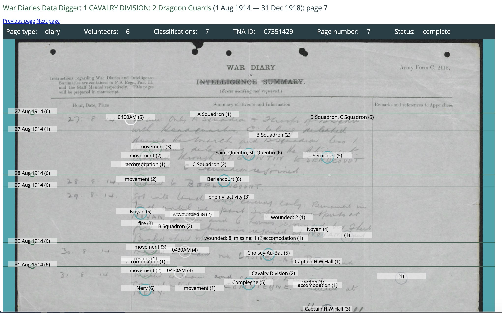

# Data

Operation War Diary transcribed a series of WWI British Army records by placing tags on a page to mark dates, times, activities, named people, named units etc. A sample diary page, with consensus tags calculated from individual volunteer 
contributions is shown here.

Data derived from the tagged pages is described here.

## /diaries

CSV exports of the tagged timeline for each diary, named by diary group ID eg. `GWD0000001.csv`
Each line represents the consensus for a single tag that was placed on the page.
Columns are:

- `Order`: tag order within the diary as a whole.
- `Page`: Zooniverse ID of the classified page.
- `Page type`
- `Page number`: Page number within the diary.
- `Count`: The number of annotations used to generate this consensus tag.
- `DateTime`: Datetime for this diary entry.
- `Date`: Date of the diary entry.
- `Place`: Any place name recorded for this entry.
- `Lat/Lon`: Latitute/Longitude.
- `Time`: Any time recorded in the diary entry.
- `Type`: Tag type.
- `Label`: Free text label for this tag.
- `Data`: Tag data. The data structure varies between tag types.
- `GeoID`: geonames.org ID of any linked place.
- `GeoName`: geonames.org name of any linked place.
- `GeoCoords`: Lat/long of any linked place.

## /groups

JSON exports of the [Group models](https://github.com/zooniverse/wd3/blob/master/app/models/group.rb), one per diary, named by the group ID eg. `GWD0000001.json`. These can be used to look up diary metadata for a given group/diary.

## /results

Aggregated results for each diary, named by diary group ID eg. `GWD0000001.json`. Each file is an array of [TImeline models](https://github.com/zooniverse/wd3/blob/master/app/models/timeline.rb), where a Timeline represents the consensus for a single tag in the overall timeline of the diary (diaryDate, place, activity, person etc.)

## places.csv

A gazetteer built from the data added by volunteers using the Place tag and the geonames.org geolocation service.
Columns are:

- `Label`: Free text labels entered by volunteers for this place.
- `Name`: Place name.
- `Identifier`: Text string used to match volunteer entries for aggregation/consensus.
- `GeoID`: geonames ID identified by volunteers as the linked place.
- `Lat`: Latitude
- `Long`: Longitude.